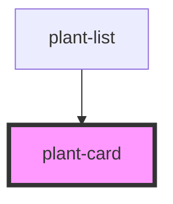

# plant-card

<!-- Auto Generated Below -->

## Properties

| Property   | Attribute | Description | Type                 | Default    |
| ---------- | --------- | ----------- | -------------------- | ---------- |
| `hostRole` | `role`    |             | `"button" \| "link"` | `'button'` |

## Dependencies

### Used by

 - [plant-list](../list)

### Graph

----------------------------------------------

*Built with [StencilJS](https://stenciljs.com/)*
